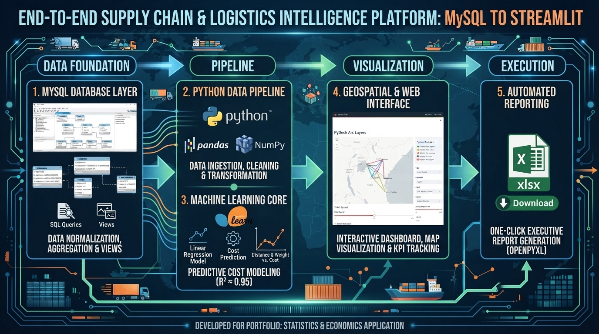

# 🚚 Supply Chain & Logistics Intelligence Platform


## 📖 Project Overview & Story
When building a modern data portfolio, assembling static dashboards in Excel or writing SQL queries in isolation only tells half the story. This system bridges raw transactional data sitting in a relational database, machine learning predictive modeling, geospatial logistics visualization, and automated executive reporting into a single, cohesive web application. 

This platform was built to solve the fragmentation typically found in regional supply chain management, where companies struggle to predict freight costs accurately, visualize transport bottlenecks across multi-border corridors, and compile stakeholder reports manually.

---

## 🎯 The Reason Behind This Project
As a Statistics and Economics graduate  building towards a career in data science and analytics, I created this platform to bridge the gap between theoretical quantitative models and real-world enterprise operations. Rather than building isolated scripts or static dashboards, this project was designed as a complete, end-to-end portfolio piece to demonstrate my capability in:
- Engineering relational database schemas and extracting clean analytical views using **MySQL**.
- Developing production-ready machine learning models using **Scikit-Learn** for predictive cost estimation.
- Designing interactive, data-driven web applications and geospatial visualizations using **Python, Streamlit, and PyDeck**.
- Solving tangible operational inefficiencies in East African trade corridors to showcase practical industry impact to potential employers.

---

## 🛑 The Problem Involved
In regional supply chains—especially across East African trade corridors spanning Nairobi, Mombasa, Kampala, and Kigali—logistics managers face three core bottlenecks:
1. **Unpredictable Freight Costs:** Shipping expenses fluctuate based on distance and cargo weight, but without predictive analytics, quoting and budgeting remain a guessing game.
2. **Blind Spot Geographies:** Standard flat charts fail to capture the physical reality and spatial distribution of multi-node warehousing and inter-city transit.
3. **Manual Reporting Friction:** Compiling monthly performance summaries, carrier reliability metrics, and route efficiencies into executive-ready formats takes hours of manual spreadsheet manipulation.

---

## 💡 The Solution
This platform automates and unifies the entire workflow:
- **Relational Data Foundation:** Pulls live, normalized operational metrics directly from MySQL database views.
- **Machine Learning Cost Estimator:** Deploys a trained Scikit-Learn linear regression model to predict freight expenses dynamically based on weight and distance.
- **Interactive Geospatial Hub:** Visualizes active shipping lanes and trade routes dynamically using PyDeck arc-line maps.
- **Automated Executive Reporting:** Generates and exports clean, multi-tab Excel workbooks instantly with a single click.

---

## 🛠️ The Technology Used
- **Database Layer:** MySQL & MySQL Workbench (Relational schema design, views, aggregations).
- **Programming Language:** Python.
- **Data Manipulation & Analysis:** Pandas, NumPy.
- **Machine Learning:** Scikit-Learn (`LinearRegression`, `train_test_split`, evaluation metrics).
- **Web UI & Geospatial Viz:** treamlit, PyDeck.
- **Reporting Engine:** OpenPyXL.

---

## 📸 System Screenshots & Interface Guide

### 1. MySQL Relational Schema & Database Views Layer
* **Visual Representation:** 
  * .jpg)
  * .jpg)
  * .jpg)
  * .jpg)
  * .jpg)
  * .jpg)
  * .jpg)
* **Explanation:** These screenshots capture the database engineering foundation inside MySQL Workbench. They show the creation and verification of normalized tables and analytical views (`vw_shipment_details`, `vw_carrier_performance`, `vw_warehouse_activity`, `vw_route_efficiency`, and `vw_monthly_summary`), which aggregate millions of rows of supply chain telemetry into clean data sources ready for python ingestion.

### 2. Python Terminal Pipelines & Model Training Layer
* **Visual Representation:** 
  * .png)
  * .png)
* **Explanation:** These terminal execution captures demonstrate the backend data connection and machine learning training pipeline. They verify successful database connectivity via `db.py` returning sample records, and show the execution of `model.py` generating statistical summaries and training the Scikit-Learn linear regression cost predictor, achieving a high accuracy score ($R^2 = 0.9454$) with calculated distance and weight coefficients.

### 3. Streamlit Executive Dashboard & Geospatial Hub
* **Visual Representation:** 
  * .jpg)
  * .jpg)
  * .png)
  * .png)
  * .png)
  * .png)
* **Explanation:** These interface screenshots illustrate the frontend web application built using Streamlit and PyDeck. They display the top-level executive KPI metrics (Total Logistics Spend, Total Tracked Shipments, and Average Cost per Kilometer), the 3D PyDeck arc-line map mapping active trade routes across East African transit nodes, the interactive machine learning slider widget estimating shipping costs in real-time, the analytical charts tracking monthly financial trends and carrier on-time performance percentages, and the fully interactive data explorer grid housing complete route efficiency records.

---

## 🚀 How to Use It

### 1. Clone the Repository
```bash
git clone [https://github.com/steph45acke-hue/A_SUPPLY_CHAIN_AND_LOGISTICS_OPTIMIZER.git](https://github.com/steph45acke-hue/A_SUPPLY_CHAIN_AND_LOGISTICS_OPTIMIZER.git)
cd A_SUPPLY_CHAIN_AND_LOGISTICS_OPTIMIZER
2. Set Up Virtual Environment
Bash
python -m venv venv
venv\Scripts\activate   # On Windows PowerShell
3. Install Dependencies
Bash
python -m pip install --upgrade pip mysql-connector-python pandas scikit-learn streamlit pydeck openpyxl
4. Configure Database Connection
Update your local MySQL credentials inside db.py:

Python
def get_connection():
    return mysql.connector.connect(
        host="localhost",
        user="root",
        password="your_mysql_password",
        database="supply_chain_optimizer"
    )
5. Launch the Dashboard
Bash
streamlit run app.py